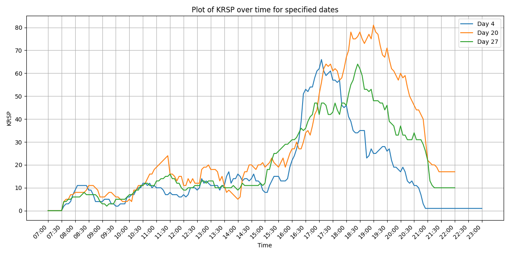
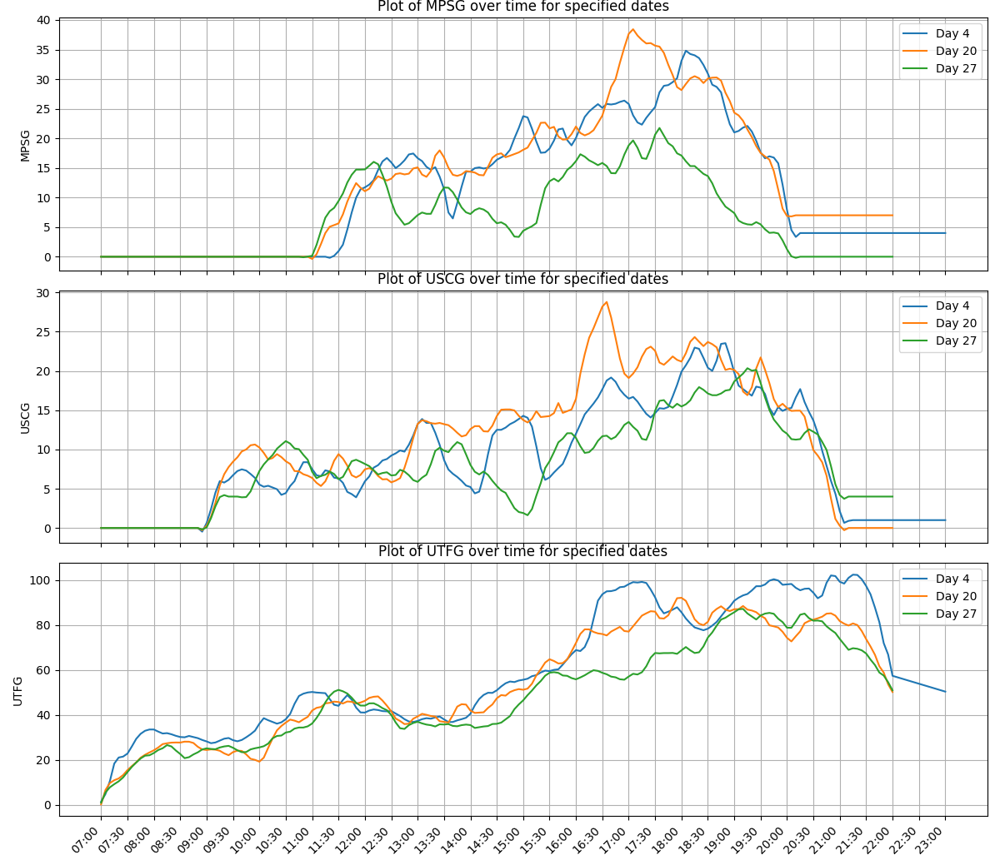
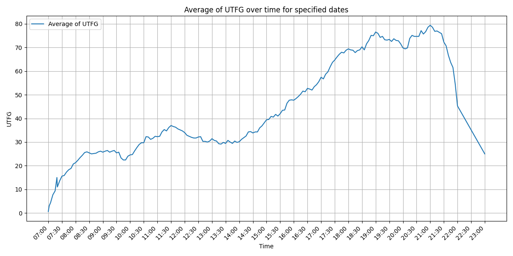
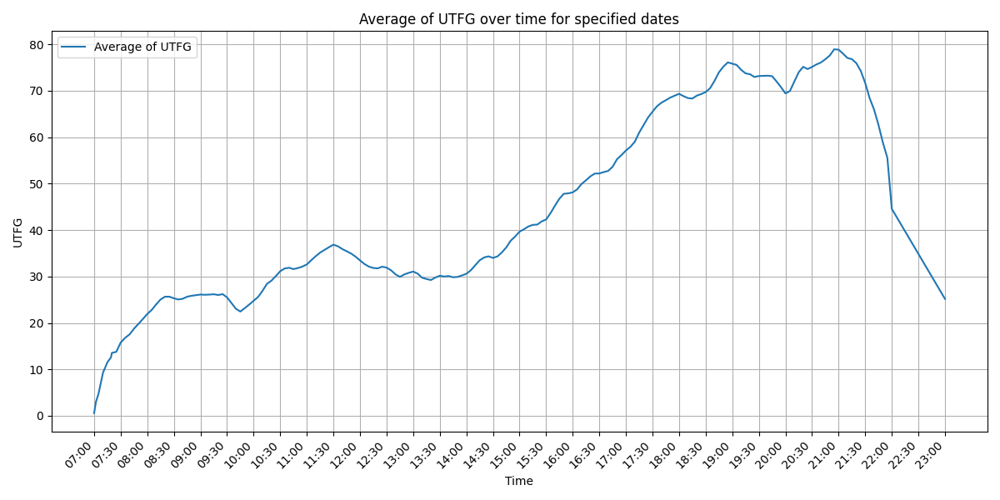

**NUS SPORT FACILITY MONITORING**

This project was created to monitor the traffic of the gyms and swimming pools for students at NUS.
The data is very limited, as the scraping of it from the webite https://reboks.nus.edu.sg/nus_public_web/public/index.php/facilities/capacity takes a lot of time. This data may be extended in the future. Also, one week of data was monitored during recess week and is therefore the usage of the sport facilities may be different from the usual traffic.

1. Facilities

We monitored 5 different facilities:
    Kent Ridge - Swimming Pool
    University Town - Recreational swimming pool
    Kent Ridge - Fitness gym @MPSH3
    University Sports Centre - Gym
    University Town - Fitness gym

2. Methods

We added a method to scrape the data from the website and add it to a .csv file. However, there would need to be adjustments made  in order to actually have more usable Data.

3. Examples

3 consecutive Fridays in the Kent Ridge Swimming Pool:

3 consecutive Fridays in the gyms (smoothed):

#
Average of consecutive 7 days in the UTown Fitness Gym:

Smoothed average of consecutive 7 days in the UTown Fitness Gym:
